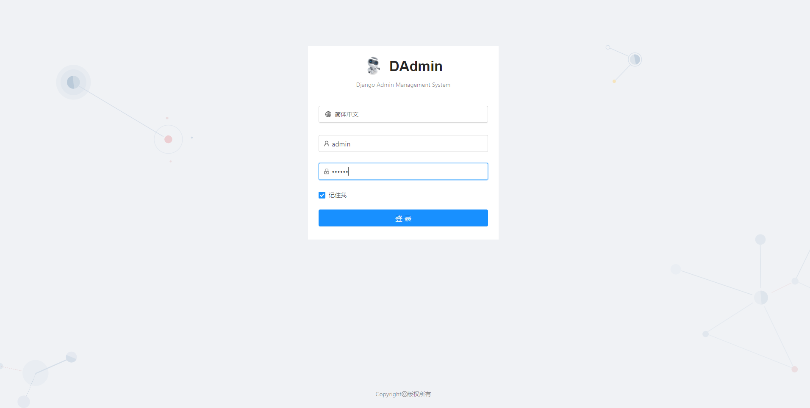

# django-admin-platform 
[](https://opensource.org/licenses/Apache-2.0)

Django back-office management platform, including the RBAC infrastructure.


## Table of contents
* [Overview](#Overview)
* [Screenshots](#screenshots)
* [Requirements](#Requirements)
* [Installation](#Installation)
* [Code Structure](#Code Structure)

## Overview
Django back-end management platform, including the RBAC infrastructure.

I haven't found a scaffolding back-end and front-end system that can be used directly in Python, so I made one with my friends.

This project is a back-end system, and the front-end system is developed using Ant-VUEgithub:https://github.com/StevenShuai/ant-design-vue-admin. 

## Screenshots


## Requirements
* python 3.7
* pandas 1.1.0
* django 3.1
* django-cors-headers 3.4.0
* django-timezone-field 4.0
* django-filter 2.3.0
* django-redis 4.12.1
* django-redis-cache 2.1.1
* djangorestframework 3.11.1
* djangorestframework-simplejwt 4.4.0
* mysqlclient 2.0.1
* drf-extensions 0.6.0
* drf-yasg 1.17.1
* django_notifications_hq 1.6.0
* pycryptodome 3.9.8

## Installation
Install dependency package

```bash
pip install -r requirements.txt
```

Modify configuration file

```bash
server\setting.py
```

Synchronous database

```bash
cd djangoAdminPlatform\apps
python ../manage.py makemigrations system
python manage.py migrate
```

Run service

```bash
cd djangoAdminPlatform
python manage.py runserver 8000
```


## Code Structure

djangoAdminPlatform

- apps - all application
  - notice  - Notify the application
  - system - System the application
- server - django config
- utils - toolkit


